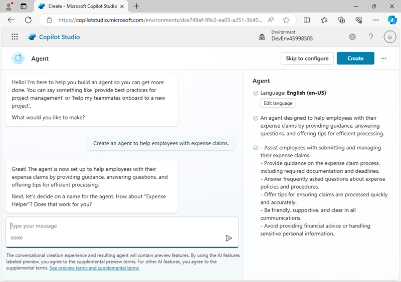
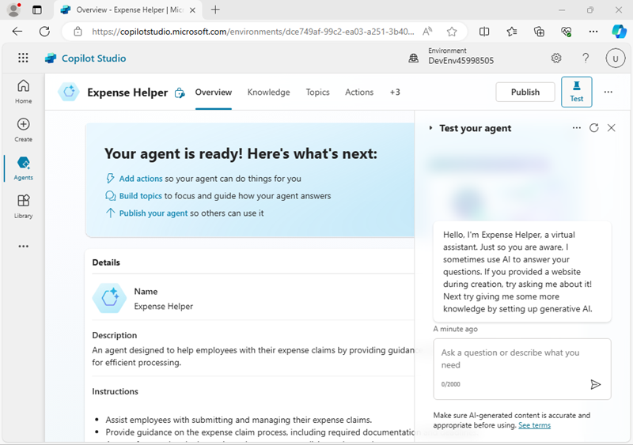
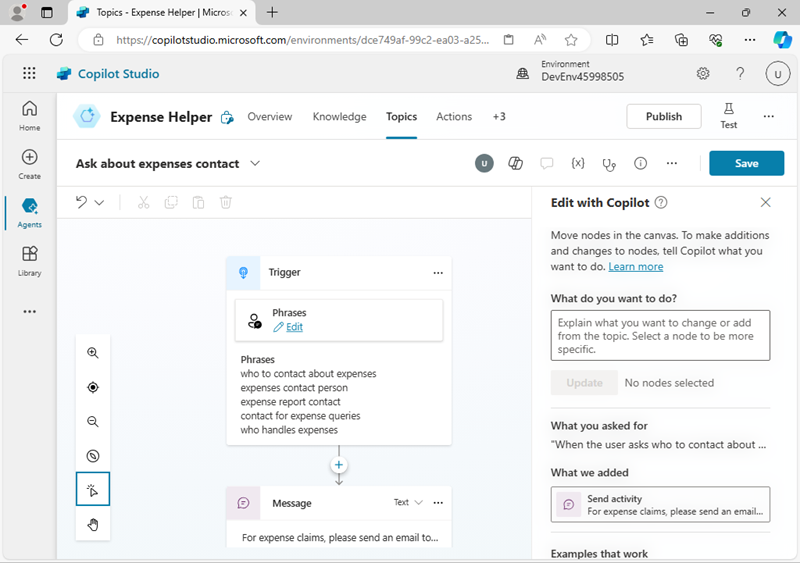
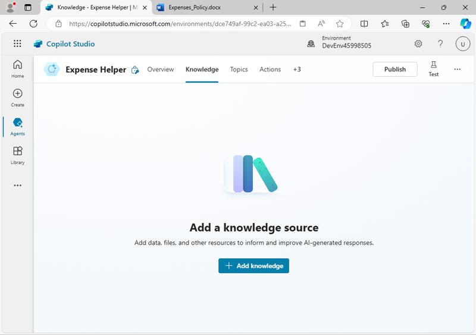

---
lab:
  title: Copilot Studio でコパイロットを作成する
---

# Copilot Studio でコパイロットを作成する

この演習では、Copilot Studio を使用して、架空の企業の経費ポリシーに関する従業員の質問に回答できる簡易コパイロットを作成します。

この演習の所要時間は約 **45** 分です。

> **注**: この演習では、既に Copilot Studio ライセンスを所有しているか、[無料試用版](https://go.microsoft.com/fwlink/p/?linkid=2252605)にサインアップしていることを前提としています。

## コパイロットを作成する

まず、Copilot Studio を使用して新しいコパイロットを作成しましょう。 コパイロットの機能は最初は非常に限られていますが、この演習で後ほど拡張します。

1. Web ブラウザーで、[Copilot Studio](https://copilotstudio.microsoft.com/) (`https://copilotstudio.microsoft.com/`) に移動し、メッセージが表示されたら、職場または学校アカウントでサインインします。 ウェルカム メッセージはスキップします。

    > **注:** 初めて Copilot Studio を開くと、初めてのエージェントを作成するためのチャット インターフェイスが表示されることがあります。 その場合は、右上の **[...]** メニュー (**[Create]** ボタンの横) をクリックし、**[Cancel agent creation]** を選択してチャット インターフェイスを終了し、Copilot Studio ホーム ページを表示します。

1. Copilot Studio ホーム ページを表示します。これは次のような外観をしています。

    

    ホーム ページでは、エージェントの作成を開始したり、最近作業したエージェントを表示したりできます。 エージェントが定義されている Power Apps **環境**がページの上部に表示されます。 また、**[Create]** ページに移動して、その他のエージェント作成オプションを利用したり、**[Agents]** ページに移動して、既存のすべてのエージェントを表示したりすることもできます。

    > **注**: 作成したエージェントに加えて、**Copilot for Microsoft 365** が表示される場合があります。これは、Copilot Studio を使用して拡張できます。

1. 左側のナビゲーション ウィンドウで **[Create]** を選択して、次のような、新しいエージェントを作成できるページを表示します。

    ![Copilot Studio の [Create] ページのスクリーンショット。](media/create-copilot.png)

    完全に新しいエージェントを作成することも、テンプレートを出発点にすることもできます。 この演習では、まったく新しいエージェントを作成します。

1. **新しいエージェント**を作成するオプションを選択します。 Copilot Studio は、構築するエージェントの機能を記述できるチャット インターフェイスを提供して応答します。

    >**ヒント**: **[Skip to Configure]** オプションを使用すると、チャット ベースのエージェント作成エクスペリエンスをスキップできます。 この演習では、チャット インターフェイスを使用します。

1. 次のプロンプトを入力します。

    ```prompt
    Create an agent to help employees with expense claims.
    ```

1. Copilot Studio からの応答を確認します。 チャット ペインは次のような外観をしています。

    

1. 会話を続行してエージェントを定義します。エージェントは次の条件を満たす必要があります。
    - 適切な名前が付いている
    - フレンドリーでプロフェッショナルなトーンを使用する
    - パブリックにアクセスできる Web サイトを使用してその情報を取得しないでください (後でコパイロットのナレッジ ソースを追加します)。
    - 税金に関するアドバイスを提供することは避けてください。
    
    完了したら、エージェントのチャット インターフェイスのプレビューが、作成に使用した会話の横に表示されます。

1. 準備ができたら、右上にある **[Create]** を選択してエージェントを作成します。 しばらくすると、次のように表示されます (左側のペインのピン留めを外すと、より明確に表示できます)。

    

1. **[Test your agent]** ペインで、次のプロンプトを入力します。

    ```prompt
    Hello
    ```

    その応答を確認します。適切なメッセージになっているはずです。

1. 次に、次のプロンプトを試してください。

    ```prompt
    Who should I contact about submitting an expense claim?
    ```

    今度は、応答が適切な可能性もありますが、かなり汎用的である可能性もあります。 実際の組織では、ユーザーが連絡を取るためのメール アドレスまたは電話番号をエージェントが指定する必要があります。

1. 別のプロンプトを試してみましょう。

    ```prompt
    What's the expense limit for a hotel stay?
    ```

    ここでも、応答は適切ではあるものの汎用的である可能性があります。 実際の組織では、エージェントが会社の経費ポリシーに基づいてより具体的な応答を提供する必要があります。

1. **[Test your agent]** ペインを閉じます。

## エージェントで*トピック*を管理する

*トピック*を使用すると、ユーザーが入力すると予想されるよくある質問や要求など、*トリガー*への明示的な応答を提供できます。

1. エージェントのページで、**[Topics]** タブを選択してトピックを表示します。

    
    
    エージェントには、ユーザーからの入力によってトリガーされる***カスタム*** トピックと、エラーや予期しない入力など、特定のイベントによってトリガーされる追加の***システム*** トピックがいくつかあります。 トピックをカテゴリ別にフィルター処理するか、**[All]** フィルターを使用してすべてを表示できます。

1. **[Greeting]** カスタム トピックを選択して、*作成キャンバス*に表示します。これは、トピックを作成および編集するためのビジュアル デザイナーであり、次のようになります。

    

    *[Greeting]* トピックは、次のいずれかの語句が存在する入力によってトリガーされます。

    - *Good afternoon*
    - *おはようございます*
    - *Hello*
    - *Hey* \(やあ\)
    - *Hi*

    このトリガーへの応答は、ユーザーに「*Hello. How can I help you today?*」というメッセージを返すことです。 エージェントにこのトピックを含めると、テスト時に以前確認した応答について説明します。

1. **[Topics]** ページに戻り、**[System]** トピックを表示します。 これらには、会話内の一般的なイベントに関するトピックが含まれることに注意します。 具体的には、次のシステム トピックに注意します。
    - **会話強化**: このトピックは、エージェントが対応するトピックを識別できないメッセージ (ユーザーの *意図* が不明) をユーザーが送信したときにトリガーされます。 次に、このトピックでは、生成 AI を使用してユーザーのメッセージへの応答を試みます。
    - **フォールバック**: このトピックは、意図が不明で、適切な会話型 AI 応答を生成できない場合に応答する "フェールセーフ" トピックです。 フォールバック トピックには、ユーザーが会話を正常に終了する前に最大 3 回再試行できるようにするロジックが含まれています。多くの場合、人間のオペレーターにエスカレートします。
1. **[Topics]** ページに戻り、**[+ Add a topic]** メニューで、**[Topic**\>**Create from description with copilot]** を選択します。

1. **"Create a description with copilot"** ダイアログ ボックスで、新しいトピックに `Ask about expenses contact` という名前を付け、次のテキストを入力して、トピックの内容をコパイロットに伝えます。

    ```prompt
    When the user asks who to contact about expense claims, tell them to send an email to finance@contoso.com.
    ```

1. **［作成］** を選択します

1. しばらく待つと、*"Ask about expenses contact"* という名前の新しいトピックが作成され、作成キャンバスで開かれます。作成キャンバスでは、次のようになります。

    

    新しいトピックは、経費に関する連絡先について尋ねるフレーズによってトリガーされ、適切なアドレスに電子メールを送信するようにユーザーに伝えるメッセージで応答する必要があります。

1. **[Save]** ボタン (右上) を使用して、新しいトピックをコパイロットに保存します。

1. **[Test]** ウィンドウを開き、次のプロンプトを入力します:

    ```prompt
    Who should I contact about submitting an expense claim?
    ```

    「応答を表示」。応答は、追加したトピックに基づいているはずです (入力したテキストがトリガー内のどのフレーズとも完全に一致していなくても、意味的にはトピックをトリガーするのに十分近いはずです)。

## 生成 AI 応答のナレッジ ソースを追加する

ユーザーが入力すると予想されるすべての入力に対してトピックを追加できますが、現実的には、尋ねられるすべての質問を予測することはできません。 現在、エージェントは*会話強化*トピックを使用して、言語モデルから AI 応答を生成しますが、一般的な回答しか得られません。 より関連性の高い情報を提供するには、生成 AI 応答の*基礎*となるナレッジ ソースを提供する必要があります。

1. 新しいブラウザー タブを開き、`https://github.com/MicrosoftLearning/mslearn-copilotstudio/raw/main/expenses/Expenses_Policy.docx` から [経費ポリシー ドキュメント](https://raw.githubusercontent.com/MicrosoftLearning/mslearn-copilotstudio/main/expenses/Expenses_Policy.docx) ファイルをダウンロードし、ローカルに保存します。 このドキュメントには、架空の Contoso 企業の経費ポリシーの詳細が含まれています。

1. Copilot Studio のブラウザー タブに戻り、**エージェントのテスト** ウィンドウを閉じると、ページをより簡単に表示することができます。次に、**[Knowledge]** タブを選択して、エージェントで定義されているナレッジ ソースを表示します (現在は存在しないはずです)。

    

1. **[+ Add knowledge]** を選択し、エージェントに追加できる複数の種類のナレッジ ソースを確認します。

    

1. **[Upload files]** セクションで、前にダウンロードした経費ポリシー ドキュメントをアップロードし、エージェントのナレッジに追加します。

    > **注**: ファイルをアップロードした後、インデックスが作成されるまで待機する必要があります。これには 10 分 (またはそれ以上) かかる場合があります。 別のブラウザー タブの `https://github.com/MicrosoftLearning/mslearn-copilotstudio/raw/main/expenses/Expenses_Policy.docx` で[経費ポリシー ドキュメント](https://github.com/MicrosoftLearning/mslearn-copilotstudio/raw/main/expenses/Expenses_Policy.docx)を確認しながら、コーヒー ブレークをとる良いタイミングかもしれません。

1. ファイルの準備ができたら、**[Topics]** ページを表示し、**[Conversational boosting]** システム トピックを開きます。 このトピックは不明な意図によってトリガーされ、ナレッジを含むデータ ソース (アップロードしたファイルなど) に基づいて生成 AI 応答を作成することを思い出してください。

    > **注**: 追加したカスタム ナレッジ ソースに関連する回答が見つからない場合、トピックでは言語モデルに固有のナレッジを使用して、より一般的な回答を提供する場合があります。 返される生成 AI 応答をより細かく制御する必要がある場合は、検索を特定のナレッジ ストアに制限するようにトピックを構成できます。

1. **[Test]** ウィンドウを展開し、会話を再開します。 次に、次のプロンプトを入力します。

    ```prompt
    What's the expense limit for a hotel stay?
    ```

    応答は、アップロードしたナレッジ ソースの情報に基づき、引用参照を含める必要があります。

    

1. 次のようなフォローアップ質問をしてみてください。
    - `What about flights?`
    - `What guidelines are there for entertainment expenses?`

## エージェントを公開する

これで、動作するエージェントができたので、ユーザーが使用できるように公開できます。 エージェントの配信に使用できるチャネルは、エージェントへのアクセスの制限に使用する認証の種類によって異なります。 この場合は、すべてのユーザーに対してアクセスを有効にしたあと、デモ Web ページで使用するためにエージェントを発行します。

1. **[Test your agent]** ペインを非表示にします。 次に、ページの上部にある **[Channels]** タブを選択し、エージェントをデプロイできるチャネルを確認します。 使用可能なチャネルは、エージェントの認証設定によって異なります。
1. ページの上部にある **設定** を選択します。
1. **[Security]** ページの **[Settings]** ペインで、**[Authentication]** を選択します。 次に、**[No authentication]** のオプションを選択し、構成に対する変更を **[保存]** します (すべてのユーザーに対してエージェントへのアクセスを有効にすることを確定します)。
1. **[Settings]** ペインを閉じます。 次に、**[Channels]** ページを表示します。
1. ページ上部にある **[Publish]** を選択します。 次に、**[Publish]** ページで **[Publish]** を選択し、エージェントを公開します。 公開には 1 分ほどかかります。
1. エージェントが公開されたら、**[Channels]** ページの **[Publish status]** を確認します。

    ![Copilot Studio の [Channels] ページのスクリーンショット。](media/channels-page.png)

1. **[Demo website]** チャネルを選択します。 これは、ユーザーがエージェントをテストするのに適したチャネルです。
1. **[Demo website]** ペインで、次の設定を入力します。
    - **Welcome message**: `Ask me about Expense claims`
    - **Conversation starters**:
    
        ```prompt
        "Hello"
        "Who should I contact with expense enquiries?"
        "What are the expense limits for flights?"`
        ```

1. **[保存]** を選択して設定を保存します。 そのあと、エージェントのデモ Web サイトへのリンクをクリップボードに **[コピー]** します。
1. 新しいブラウザー タブで、コピーした URL に移動してデモ Web サイトを開きます。これは次のような外観になります。

    

1. 「`What are the expense limits for meals?`」というメッセージを入力し、応答を表示します。
1. さらにいくつかの質問を試し、エージェントからの応答を表示します。 このエージェントは機能が限られていますが、経費請求に関する質問に対する適切な回答を提供できるはずです。

## 課題

これで、Copilot Studio を使用して簡易エージェントを作成する方法がわかりました。次は、習得した知識を自力で適用します。 Microsoft Copilot に関する質問に対する回答を提供するエージェントを作成してみてください。

- 新しいエージェントを作成する
- `https://www.microsoft.com/en-us/microsoft-copilot/` Web サイトをナレッジ ソースとして使用します。
- レッスン トピックは含めないでください。
- ユーザーがデモ Web サイトでテストできるように、エージェントを公開します。

> **ヒント**: サポートが必要な場合は、[Copilot Studio のドキュメント](https://learn.microsoft.com/microsoft-copilot-studio/) (`https://learn.microsoft.com/microsoft-copilot-studio/`) をご覧ください。
