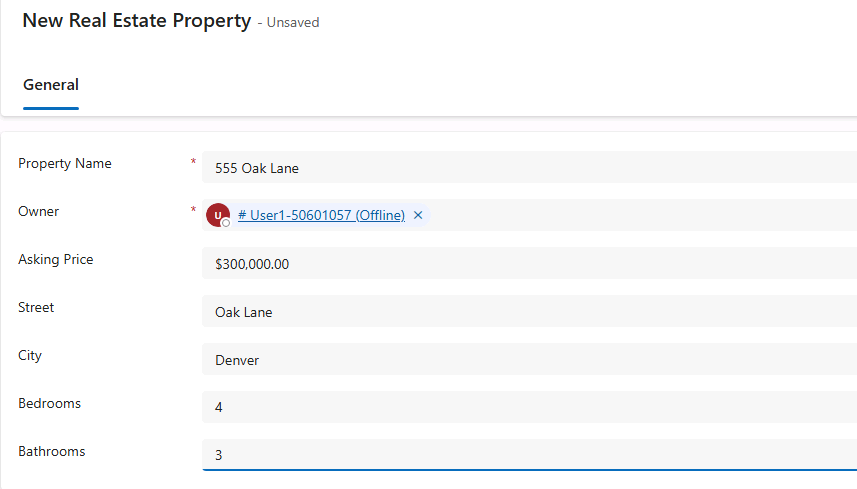

---
lab:
  title: Dataverse ソリューションをインポートする
  module: Build an initial agent with Microsoft Copilot Studio
---

# Dataverse ソリューションをインポートする

この演習では、次のラボに使用する Dataverse ソリューションをインポートします。

この演習の所要時間は約 **10** 分です。

> **注**: この演習では、既に Copilot Studio ライセンスを所有しているか、[無料試用版](https://go.microsoft.com/fwlink/p/?linkid=2252605)にサインアップしており Power Platform 環境を使用していることを前提としています。

## 演習 1 – ソリューションをインポートする

この演習では、ラボに必要なテーブルを含む環境に Dataverse ソリューションをインポートします。

### タスク 1.1 - ソリューションをダウンロードする

1. 新しいブラウザー タブで、GitHub の `https://github.com/MicrosoftLearning/mslearn-copilotstudio/blob/main/Allfiles/Bookings_1_0_0_0.zip` にある **Bookings_1_0_0_0.zip** ファイルに移動します。

1. 右上の **省略記号(...)** を選択し、 **[ダウンロード]** を選択します。

1. ブラウザー タブを閉じます。

### タスク 1.2 - ソリューションをインポートする

1. 新しいブラウザー タブで、`https://make.powerapps.com` に移動します。

1. 資格情報の入力を求められたら、メール アドレスとパスワードでサインインします。

1. 連絡先情報の入力を求められたら、国/地域を設定し、**[開始する]** を選択します。

1. 画面の右上で、 **[環境]** がユーザーの環境に設定されていることを確認します。 ここで、このラボ全体の作業を行います。 設定されていない場合は、適切な環境を選びます。

1. 左側のナビゲーションで **[ソリューション]** を選択します。

1. 上部のツール バーで **[ソリューションのインポート]** を選択します。

1. **[参照]** を選択し、ダウンロード フォルダーから **Bookings_1_0_0_0.zip** ファイルを見つけて **[開く]** を選択します。

    

1. [**次へ**] を選択します。

1. **[インポート]**を選択します。

    ソリューションはバックグラウンドでインポートされます。 これには数分かかることがあります。

    

    > **警告:** ソリューションのインポートが完了するのを待ってから、次のステップに進みます。

1. ソリューションが正常にインポートされたら、 **Bookings** ソリューションを開きます。

1. 左側のナビゲーション ウィンドウで、**[概要]** タブを選択します。

    ![[ソリューション概要] タブ](../media/solution-overview.png)

1. **[すべてのカスタマイズの公開]**を選択します。

### タスク 1.3 - テスト データ

1. Bookings ソリューションの左側のナビゲーションで、 **[オブジェクト]** タブを選択します。

1. **Real Estate Property Management** モデル駆動型アプリ のメニューで、**[再生]** を選択します。

    

1. **[+ 新規]** を選択します。

1. 以下のデータを入力します。

    - **プロパティ名:** `1100 High Villas`
    - **所有者:** ユーザーを選択します
    - **希望価格:** `250,000`
    - **番地:** `Main Avenue`
    - **市区町村:** `Redmond`
    - **寝室数:** `3`
    - **浴室数:** `2`

    

1. **保存して閉じる** を選択します。

1. **[+新規]** を選択します。

1. 以下のデータを入力します。

    - **プロパティ名:** `555 Oak Lane`
    - **所有者:** ユーザーを選択します
    - **希望価格:** `300,000`
    - **番地:** `Oak Lane`
    - **市区町村:** `Denver`
    - **寝室数:** `4`
    - **浴室数:** `3`

    

1. **保存して閉じる** を選択します。

現在、ビューには 2 件の Active Real Estate Properties があります。 
