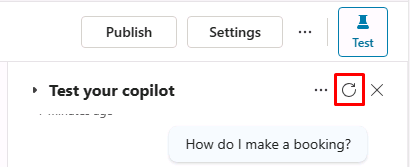

---
lab:
  title: 最初のエージェントを構築する
  module: Manage topics in Microsoft Copilot Studio
---

# 最初のエージェントを構築する

## シナリオ

この演習では、次のことを行います。

- エージェントを作成して名前を付ける
- エージェントが行うべきタスクについての説明を追加する
- 生成 AI の回答を構成する

この演習の所要時間は約 **15** 分です。

## 学習する内容

- 自然言語を使用してエージェントを作成する方法
- 生成 AI の回答をエージェント用に構成する方法

## ラボ手順の概要

- 新しいエージェントを作成する
- その主な目的が何であり、どのように動作すべきかをエージェントに伝えます。
- 生成 AI への指示を構成する
  
## 前提条件

- **ラボ: Dataverse ソリューションのインポート**を完了している必要があります

## 演習 1 - エージェントを作成する

この演習では、Microsoft Copilot Studio ポータルの開発環境にアクセスし、新しいエージェントを作成します。

### タスク 1.1 - Microsoft Copilot Studio ポータル

1. 新しいタブで、Microsoft Copilot Studio ポータル `https://copilotstudio.microsoft.com` に移動し、もう一度メッセージが表示されたら、Microsoft 365 の資格情報でサインインします。

1. メッセージが表示されたら、**[無料試用版の開始]** を選択します。

1. 適切な環境にいることを確認します。

### タスク 1.2 - エージェントを作成する

1. 左側のナビゲーション ウィンドウで **[作成]** を選択し、右上の **[+ 新しいエージェント]** と **[構成のスキップ]** を選択します。

1. **[Name]** テキスト ボックスに「**`Real Estate Booking Service`**」と入力します。

1. **[Description]** テキスト ボックスに「**`Create bookings for real estate properties`**」と入力します。

1. **[Instructions]** テキスト ボックスに「**`Create an agent for topics relating to creating bookings for real estate properties`**」と入力します。

1. 上部で、**[Language]** を **English (en-US)** に設定してください。

    

1. ページの右上にある **3 つのドット**を選択し、**[Edit advanced settings]** を選択します。

    

1. **[Solution]** で **[Bookings]** を選択します。

1. **[Schema Name]** に「`labagent`」と入力します。

    

1. **[保存]** を選択します。

1. 画面の右上で **[Create]** を選択します。

1. 右側の **[Test your agent]** ペインに「**`How do I make a booking?`**」と入力します。 応答を表示します。

このウィンドウは開いたままにします。

## 演習 2 - 生成 AI の回答を追加する

この演習では、Microsoft Copilot Studio ポータルにアクセスし、エージェントが生成 AI を使用して質問に回答するために使用する知識を追加します。

### タスク 2.1 - 生成オーケストレーションを無効にする

1. **[概要]** タブで、**[ユーザーやイベントに最適な応答方法を、生成 AI を使用して決定します。]** が  **[無効]** に設定されていることを確認します (**[詳細]** セクション内)。

    

### タスク 2.2 - 生成 AI の回答を有効にする

1. **[Overview]** タブの **[Knowledge]** セクション内で、**[Allow the AI to use its own general knowledge]** が **[Enabled]** に設定されていることを確認します。

    

### タスク 2.3 - ナレッジ ソースを追加する

1. **[Knowledge]** タブを選択します。

    ![Copilot Studio ポータルの [Knowledge] タブ。](../media/knowledge-tab.png)

1. **[+ Add knowledge]** を選択します。

1. **[Public websites]** を選択する

1. **"Public website link"** テキスト ボックスに「**`https://create.microsoft.com/en-us/`**」と入力します。

    

1. **[追加]** を選択します。

1. **[追加]** を選択します。

1. **[概要]** タブを選択します。

1. **[Test your agent]** ウィンドウの上部にある **[three dots]** を選択します。

1. **[Track between topics]** を有効にします。

    

1. **[Test your agent]** ウィンドウの上部で、**[Start a new conversation]** アイコン (更新アイコン) を選択します。

    

1. **[Ask a question or describe what you need]** テキスト ボックスに、「**`How do I boost real estate promotion?`**」と入力します。

    
