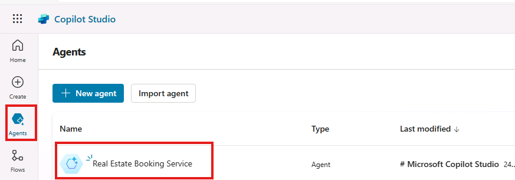
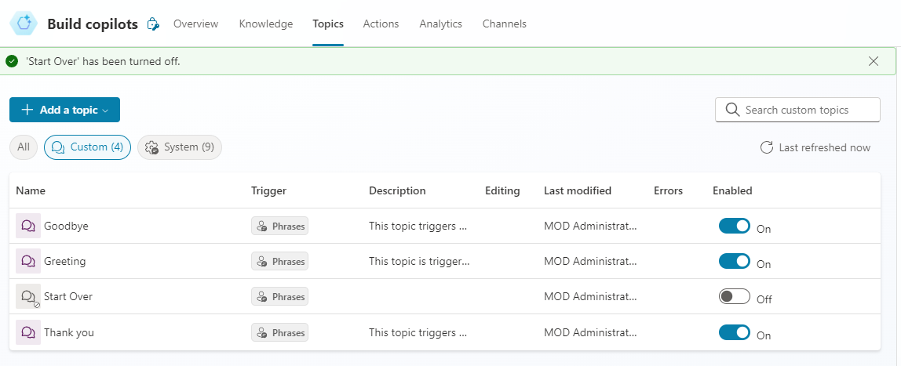
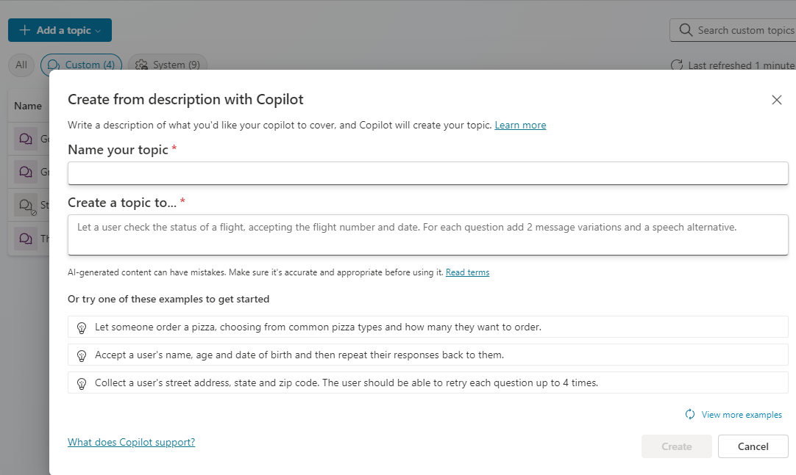
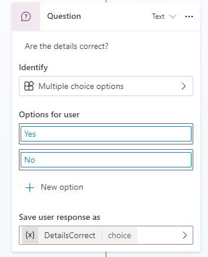
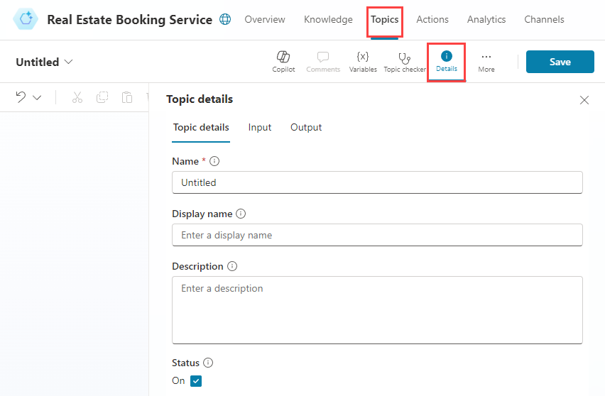

---
lab:
  title: トピックの管理
  module: Manage topics in Microsoft Copilot Studio
---

# トピックの管理

## シナリオ

この演習では、次のことを行います。

- 既存のトピックを管理する
- 自然言語を使用してトピックを作成および編集する
- トリガー フレーズを使用してトピックを手動で作成する

この演習の所要時間は約 **30** 分です。

## 前提条件

- **ラボ: 最初のエージェントを構築する**を完了している必要があります

## 詳細な手順

## 演習 1 - トピックを削除する

この演習では、エージェント内のトピックを削除します。

### タスク 1.1 - トピックを無効にする

1. Microsoft Copilot Studio ポータル `https://copilotstudio.microsoft.com` に移動し、適切な環境にあることを確認します。

1. 左側のナビゲーション ウィンドウから **[エージェント]** を選択します。

    

1. 前のラボで作成したエージェントを選択します。

1. **[トピック]** タブを選択します。

1. **[最初からやりなおす]** トピックの **[有効]** を **[オフ]** に切り替えます。

    

## 演習 2 - 自然言語でトピックを作成する

この演習では、エージェントにトピックを作成し、トリガー フレーズを追加します。

### タスク 2.1 - Copilotを使用してトピックを追加する

1. **[+ トピックの追加]** を選択し、**[Copilot で説明をもとに追加する]** を選択します。 新しいウィンドウが開きます。

    

    

1. **[トピック名を指定する]** テキスト ボックスに「**`ユーザーの情報`**」と入力します。

1. **[トピックを作成する...]** テキスト ボックスに「**`ユーザーの氏名とメールアドレスを尋ねる`**」と入力します。

1. **[作成]** を選択します。

1. **[保存]** を選択します。

### タスク 2.2 - 自然言語でノードを更新する

1. **[ユーザーの情報]** ペインの右側に **[Copilot で編集]** ペインが表示されない場合は、作成キャンバスの上部にある**Copilot** アイコンを選択します。

    ![[Copilot で編集] アイコンのスクリーンショット。](../media/edit-with-copilot.png)

1. 2 番目の **[質問]** ノードである **[あなたのメールアドレスを教えてください。]** を選択します。

    ![[Copilot で編集] アイコンのスクリーンショット。](../media/copilot-email-address-node.png)

1. **Copilot で編集**パネルで、**何の操作を実行しますか?** フィールドに、次のテキストを入力します。

    `「あなたのメールアドレスを教えてください。」を書き換えて、前のノードの Name 変数にお礼を述べたあとに、メール アドレスを尋ねる質問をするよう変更してください。`

1. **[更新]** を選択します。

    ![プロンプトを含む [Copilot で編集] パネルのスクリーンショット。](../media/edit-with-copilot-panel.png)

    

    > **注**: メッセージは、先ほどのノードの *Name* 変数を含むように更新されるはずです。上記のスクリーンショットのようになります。 [Copilotで編集する] で質問ノードが正しく更新されなかった場合は、[元に戻す] を選択し、別のプロンプトでもう一度試します。

1. **[保存]** を選択します。

### タスク 2.3 – 自然言語でノードを追加する

既存のノードを更新する他に、Copilotを 使用して新しいノードを追加できます。

1. 作成キャンバス内の空白部分を選択して、ノードが選択されていないことを確認します。

1. **Copilot で編集**パネルで、**何の操作を実行しますか?** フィールドに、次のテキストを入力します。

    `収集した情報をアダプティブ カードで要約してください`

1. **[更新]** を選択します。

1. トピックの末尾に、アダプティブ カードを含むメッセージ ノードが追加されます。

    

1. アダプティブ カードの **[メディア]** ボックスを選択します。 画面の右側にアダプティブ カードのプロパティが表示されます。

    

   アダプティブ カードの式は、上記のようになります。 このようになっていない場合は、以下の式を貼り付けることができます。

    ```json
    {
    type: "AdaptiveCard", 
        body: 
        [
            {
                type: "TextBlock",
                size: "Medium",
                weight: "Bolder",
                text: "Summary"    
            },
            {
                type: "FactSet",
                facts: 
                [
                    {
                        title: "Full Name",
                        value: Text(Topic.Name)
                    },
                    {
                        title: "Email Address",
                        value: Text(Topic.EmailAddress)
                    }
                ]
            },
            {
                type: "TextBlock",
                text: "Thank you for providing the information."
            }
        ]
    }
    ```

1. 作成キャンバス内の空白部分を選択して、ノードが選択されていないことを確認します。

1. **何の操作を実行しますか?** フィールドに、次のテキストを入力します。

    `情報が正しいかをユーザーに確認するための新しい選択式の質問を追加し、選択肢は はい と いいえ の2つにしてください`

1. 変数名を **[DetailsCorrect]** に変更します。

1. **[更新]** を選択します。

    トピックの末尾に、ユーザーが選択できるオプションを含む新しい質問ノードが追加されます。

    
    

1. **[保存]** を選択します。

### タスク 2.4 - トピックをテストする

1. **[エージェントのテスト]** パネルが閉じている場合は、パネルの右上にある **[テスト]** ボタンを選択します。

1. テスト パネルの上部にある **[新しい会話を開始する]** (更新) アイコンを選択します。

1. **[質問するか、または目的を説明します]** テキスト ボックスに、「**`ユーザーの情報`**」と入力します。

1. 名前とメール アドレスを入力します。

1. **[はい]** を選択します。

## 演習 3 - トピックを手動で作成する

トリガー フレーズを追加してトピックを手動で作成できます

### タスク 3.1 - 空白からトピックを作成する

1. **不動産予約サービス** の上部バーにある **[トピック]** タブを選択します。

1. **[+ トピックを追加]** を選択し、**[最初から]** を選択します。

1. **[詳細]** アイコンを選択して、"トピックの詳細" ダイアログを開きます。

    

1. **"名前"** フィールドに、次のテキストを入力します。

    `不動産の内見の予約`

1. **"表示名"** フィールドに、次のテキストを入力します。

    `予約`

1. **"説明"** フィールドに、次のテキストを入力します。

    `物件と希望日を選択して予約リクエストを作成します`

1. **[保存]** を選択します。

### タスク 3.2 - トリガー フレーズを追加する

1. **[トリガー]** の **[ユーザーが語句を発声した時]** の下の **[編集]** を選択します。

    

1. **[フレーズの追加]** に「`不動産の内見を予約したい`」と入力し、**+** アイコンを選択します。

1. **[フレーズの追加]** に「`不動産の内見を予定`」と入力し、**+** アイコンを選択します。

1. **[フレーズの追加]** に「`不動産物件の内見を手配`」と入力し、**+** アイコンを選択します。

1. **[フレーズの追加]** に「`家の内見の予約を設定`」と入力し、**+** アイコンを選択します。

1. **[フレーズの追加]** に「`物件の内見を計画`」と入力し、**+** アイコンを選択します。

1. **[保存]** を選択します。
