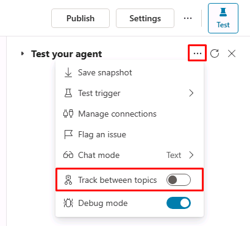

---
lab:
  title: ノードを管理する
  module: Manage topics in Microsoft Copilot Studio
---

# ノードを管理する

## シナリオ

このラボでは、次のことを行います。

- 会話フローを作成する

## 学習する内容

- トピックにノードを追加して会話フローを作成する方法

## ラボ手順の概要

- 変数スコープを構成する
- ノードの作成と編集
  
## 前提条件

- **ラボ: トピックの管理**を完了している必要があります

## 詳細な手順

## 演習 1 - 変数スコープ

変数には他のトピックからアクセスできます。

### タスク 1.1 - 変数のスコープを構成する

1. Microsoft Copilot Studio ポータル `https://copilotstudio.microsoft.com` に移動し、適切な環境にあることを確認します。

1. 画面の右上にある **[Test]** ボタンを選択して、パネルが開いている場合はテスト パネルを閉じます。

1. 左側のナビゲーション ウィンドウから **[エージェント]** を選択します。

1. 前のラボで作成したエージェントを選択します。

1. **[Topics]** タブを選択します。

1. **[Customer Details]** トピックを選択します。

1. 変数ウィンドウを開くには、トピックのメニュー バーで、**[Variables]** を選択します。

1. 3 つのトピック変数の右側のチェック ボックスをオンにします。

    

1. **[保存]** を選択します。

## 演習 2 - トピックを手動で作成する

トピック内の会話フローは、ノードを追加して手動で作成できます。

### タスク 2.1 - メッセージ ノードを追加する

1. **[Topics]** タブを選択します。

1. **[不動産の内見を予約する]** トピックを選択します。

1. トリガー ノードの下にある **[+]** アイコンを選択し、**[Send a message]** を選択します。

    

1. **"Enter a message"** フィールドに、次のテキストを入力します。

    `Hi, I can help you with booking a real estate property showing.`

1. **[保存]** を選択します。

### タスク 2.2 - トピック管理ノードを追加する

1. **[Message]** ノードの下にある **[+]** アイコン、**[Topic management]**、**[Go to another topic]** の順に選択してから、**[Customer Details]** を選択します。

    

1. **[保存]** を選択します。

### タスク 2.3 - 条件を追加する

1. **[Redirect]** ノードの下にある **[+]** アイコンを選択し、**[Add a condition]** を選択します。

1. **[Condition]** ノードで、**[DetailsCorrect]** 変数を選択します。

1. **[is equal to]** を選択します。

1. **[はい]** を選択します。

    

1. **[保存]** を選択します。

### タスク 2.4 - 質問ノードを追加する

1. 左側の **[Condition]** ノードの下にある **[+]** アイコンを選択し、**[Ask a question]** を選択します。

1. **"Enter a message"** フィールドに、次のテキストを入力します。

    `Which property do you want to see?`

1. **[Identify]** には、**[User's entire response]** を選択します。

1. **[Save user response as]** で変数を選択し **[Variable name]** に「**`PropertyName`**」と入力します。

    

1. **[保存]** を選択します。

1. 新しい **Question** ノードの **[+]** アイコンを選択し、**[Ask a question]** を選択します。

1. **"Enter a message"** フィールドに、次のテキストを入力します。

    `What date and time do you want to see the property?`

1. **[Identify]** で **[Date and time]** を選択します。

1. **[Save user response as]** で変数を選択し **[Variable name]** に「**`DateTime`**」と入力します

1. **[保存]** を選択します。

### タスク 2.5 - エージェントをテストする

1. 開かない場合は、画面の右上にある **[Test]** ボタンを選択してテスト パネルを開きます。

1. 画面の右上にあるテスト パネルの上部にある **3 つのドット**を選択します。

1. 有効になっていない場合は、 **[Track between topics]** を有効にします。

    

1. テスト パネルの上部にある **[Start a new conversation]** アイコンを選択します。

1. **会話の開始**メッセージが表示されたら、エージェントによって会話が開始されます。 応答に、先に作成したトピックのトリガー フレーズを入力します。

    `I want to book a real estate showing`

1. エージェントは、次の図に示すように、 "What is your name?" の質問で応答します。

    

1. 名前とメール アドレスを入力します。

1. 情報を入力すると、入力した情報がアダプティブ カードに表示され、詳細が正しいかどうかを確認します。 **[はい]** を選択します。

1. **Which property to you want to see?** プロンプトに `555 Oak Lane, Denver, CO 80203` を入力します。

1. **What date and time do you want to see the property?** プロンプトに `Tomorrow 10:00 AM` を入力します。

    

## 演習 3 - エージェントをデプロイする

### タスク 3.1 - 認証の構成

1. **Real Estate Booking Service** の右上にある **[Settings]** を選択します。

1. **[セキュリティ]** タブをクリックします。

1. **認証** タイルを選択します。

    

1. **認証なし**を選択します。

1. **[保存]** を選択します。

1. 確認ウィンドウで **[Save]** を選択します。

1. 右上隅にある **X** を選択して、**[Settings]** を閉じます。

### タスク 3.2 - エージェントを発行する

1. 右上にある **[Publish]** を選択し、もう一度 **[Publish]** を選択します。

### タスク 3.3 - デモ Web サイト

1. 画面の右上にある **[Settings]** ボタンの横にある **3 つのドット**を選択し、**[Go to demo website]** を選択します。

1. **[Type your message]** テキスト ボックスに、「**`I want to book a property`**」と入力します。

1. プロンプトに答えて、エージェントをテストします。
