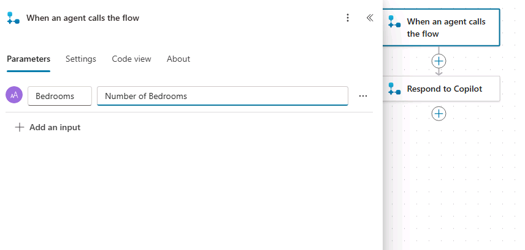

---
lab:
  title: エージェント アクションを作成する
  module: Enhance Microsoft Copilot Studio agents
---

# エージェント フローを作成する

## シナリオ

この演習では、次のことを行います。

- エージェント フローを作成する

この演習の所要時間は約 **30** 分です。

## 学習する内容

- Copilot Studio でエージェント フローを実行するツールを作成する方法

## ラボ手順の概要

- エージェント アクションを使用して Dataverse データを取得するためのエージェント フローを作成する
- エージェント アクションを使用して Dataverse データを作成するエージェント フローを作成する
  
## 前提条件

- **ラボ: エンティティの使用**を完了している必要があります

## 詳細な手順

## 演習 1 - エージェント アクションを作成して Dataverse からデータを取得する

Microsoft Copilot Studio では、エージェント フローを使用して Microsoft Dataverse 内のデータにアクセスできます。

### タスク 1.1 - プロパティを取得するエージェント フローを作成する

1. Microsoft Copilot Studio ポータル `https://copilotstudio.microsoft.com` に移動し、適切な環境にあることを確認します。

1. 左側のナビゲーション ウィンドウから **[エージェント]** を選択します。

1. 前のラボで作成した **[Real Estate Booking Service]** を選択します。

1. **[ツール]** タブを選択します。

1. **[+ ツールの追加]** を選択します。

1. **[+ 新しいツール]** を選択します。

1. **[エージェント フロー]** を選択します。

1. **[エージェントがフローを呼び出したとき]** のトリガーステップを選択し、**[+ 入力の追加]** を選択します。

1. **[テキスト]** を選択します。

1. **[入力]** に「`Bedrooms`」を入力し、**[入力してください]** に「`Number of Bedrooms`」を入力します。

    

1. フロー内の 2 つのステップの間の **+** アイコンを選択し、新しいアクションを追加します。

1. **[検索]** フィールドに「`Dataverse`」と入力し、**Microsoft Dataverse** コネクタの **[詳細情報]** を選択します。

    ![[フローのコネクタを検索する] のスクリーンショット。](../media/create-flow-step3.png)

1. **[行の一覧表示]** アクションを選択します。

1. 認証を求められた場合は、**[接続名]** に「`Lab connection`」と入力し、**[認証の種類] に **[OAuth]** を選択して、**[サインイン]** を選択します。

    > **注:** 「**OAuth 接続の作成に失敗しました**」というエラーが表示された場合は、ブラウザーでポップアップを許可する必要があります。

    

    

1. テーブル名に **[不動産物件]** テーブルを選択します。

1. **[行のフィルター選択]** フィールドに「`contoso_bedrooms eq `」と入力します (**eq** の後にスペースを入れます)。

1. **[行のフィルター選択]** フィールドを選択したまま、右側にある **[Lightning]** アイコンを選択し、**[Bedrooms]** パラメーターを選択します。

    

    > **重要:** eq と Bedrooms の間にスペースがあることを確認します。

1. 作成キャンバスで **[Copilot に応答する]** アクションを選択し、**[+ 出力の追加]** を選択します。

1. **[テキスト]** を選択します。

1. **[名前を入力する]** に「`PropertyId`」を入力する

1. **[応答する値を入力する]** フィールドを選択し、**[fx (式を挿入する)]** を選択します。

1. 一番上のフィールドに、次の式を入力します。

    ```
    first(outputs('List_rows')?['body/value'])['contoso_realestatepropertyid']
    ```

1. **[追加]** を選択します。

1. **+ 出力を追加** を選択します。

1. **[テキスト]** を選択します。

1. **[名前を入力する]** に「`PropertyName`」を入力します。

1. **[応答する値を入力する]** フィールドを選択し、**[fx (式を挿入する)]** を選択します。

1. 次の式を入力します。

    ```
    first(outputs('List_rows')?['body/value'])['contoso_propertyname']
    ```
    

1. **[追加]** を選択します。

1. **[Copilot に対して応答]** ウィンドウで **[設定]** タブを選択します。

1. **[非同期応答]** が **オフ** に設定されていることを確認します。

    ![[応答アクションの設定] のスクリーンショット。](../media/create-flow-step6.png)

1. ページの右上付近にある **[下書きを保存]** を選択します。

1. 保存が完了するまで待ってから、**[公開]** を選択します。 **[エージェント フローが正常に公開されました]** ポップアップで、**[エージェントに戻る]** を選択します。

1. **[概要]** タブを選択します。

1. **[詳細]** セクションの **[編集]** を選択します 

1. **[フロー名]** を `Get Property` に更新します

1. **[保存]** を選びます。

1. **[エージェント]** を選択し、**[Real Estate Booking Service]** エージェントを選択します。 

1. **[ツール]** を選択し、作成した [プロパティの取得] フローを確認します。


### タスク 1.2 - [プロパティを取得する] エージェント アクションをトピックに追加する

1. **[Topics]** タブを選択します。

1. **[不動産の内見を予約する]** トピックを選択します。

1. **[How many bedrooms do you need question?]** ノードの下にある **+** アイコンを選択し、**[ツールの追加]** を選択してから **[プロパティの取得]** フローを選択します。

1. **Bedrooms** 入力パラメーターの **NumberofBedrooms** 変数を選択します。

    ![[フロー アクションを追加する] の手順 3 のスクリーンショット。](../media/add-action-flow-step-3.png)

1. **[どのプロパティを表示しますか?]** 質問ノードで **3 つのドット**を選択し、**[削除]** を選択します。

1. **[Action]** ノードの下にある **[+]** アイコンを選択し、**[Send a message]** を選択します。

1. **[メッセージの入力]** フィールドで「`Property `」と入力します (その後にスペースを付けます)。

1. 同じノードで、 **[{X} (変数の挿入)]** アイコンを選択し、 **PropertyName** 変数を選択します。

    ![[フロー アクションを追加する] の手順 4 のスクリーンショット。](../media/add-action-flow-step-4.png)

1. **[保存]** を選択します。

## 演習 2 - エージェント アクションを作成して Dataverse でデータを作成する

Microsoft Copilot Studio では、エージェント フローを使用して Microsoft Dataverse 内にデータを作成できます。

### タスク 2.1 - 予約を行うエージェント フローを作成する

1. **Real Estate Booking Service** の **[ツール]** タブを選択します。

1. **[+ ツールの追加]** を選択します。

1. **[+ 新しいツール]** を選択し、**[エージェント フロー]** を選択します。

1. **[下書きの保存]** を選択し、エージェント フローが保存されるまで待ちます。

1. **[概要]** タブを選択します

1. **[詳細]** セクションの **[編集]** を選択します 

1. フロー `Create Booking Request` の名前を変更する

1. **[保存]** を選択します。

1. **[デザイナー]** タブを選択します。

1. **[エージェントがフローを呼び出したとき]** のトリガーステップを選択し、**[+ 入力の追加]** を選択します。

1. **[テキスト]** を選択します。

1. **[入力]** に「`PropertyId`」を入力し、**[入力してください]** に「`Property`」を入力します。

1. **+ 入力の追加**を選択します。

1. **[テキスト]** を選択します。

1. **[入力]** に「`ViewerName`」を入力し、**[入力してください]** に「`Viewer Name`」を入力します。

1. **+ 入力の追加**を選択します。

1. **[テキスト]** を選択します。

1. **[入力]** に「`ViewerEmail`」を入力し、**[入力してください]** に「`Viewer Email`」を入力します。

    

1. フロー内の 2 つのステップの間の **+** アイコンを選択し、新しいアクションを追加します。

1. **[検索]** フィールドに「`Dataverse`」と入力し、**Microsoft Dataverse** コネクタの **[詳細情報]** を選択します。

1. **[新しい行を追加する]** アクションを追加します。

1. テーブル名として **[予約要求]** を選択します。

1. **[予約名]** フィールドに「`Agent booking`」と入力します。

1. **詳細パラメーター**で**すべて表示**を選択します。

1. **プロパティ (不動産プロパティ)** フィールドに「`contoso_bookingrequests()`」と入力し、かっこ内にカーソルを移動し、**[Lightning]** アイコンを選択してから、**PropertyId** パラメーターを選択します。

1. **[ビューアー メール]** フィールドを選択し、**[Lightning]** アイコンを選択してから、**ViewerEmail** パラメーターを選択します。

1. **"Viewer Name"** フィールドを選択し、**[Lightning]** アイコンを選択してから、**[ViewerName]** パラメーターを選択します。

    

1. **[Respond to Copilot]** アクション選択します。

1. **[Settings](設定)** タブを選択します。

1. **[非同期応答]** が **オフ** に設定されていることを確認します。

1. ウィンドウの右上にある **[下書きを保存]** を選択します。

1. 保存が完了するまで待ってから、**[公開]** を選択します。

1. **[概要]** タブを選択します。

1. [詳細] セクションの **[編集]** を選択します

1. エージェント フローの名前を `Create Booking Request` に変更します

1. **[保存]** を選択します。

### タスク 2.2 - ツールを検証する

1. **[エージェント]** を選択し、**[Real Estate Booking Service]** エージェントを開きます。

1. **[ツール]** タブを選択し、両方のエージェント フローが一覧にあることを確認します。 ない場合は、**[+ ツールの追加]** > **[フロー]** を選択し、不足しているエージェント フローを選択します。 **[エージェントへの追加]** を選択します。

### タスク 2.3 - [Create Booking Request] エージェント アクションをトピックに追加する

1. **[Topics]** タブを選択します。

1. **[不動産の内見を予約する]** トピックを選択します。

1. **[What date and time do you want to see the property?]** ノードの下にある **+** アイコンを選択し、**[ツールの追加]** を選択してから **[Create Booking Request]** フローを選択します。

1. **PropertyId**入力パラメーターに、**[PropertyId]** 変数を選択します。

1. **ViewerName**入力パラメーターに、**[Name]** 変数を選択します。

1. **ViewerEmail**入力パラメーターに、**[EmailAddress]** 変数を選択します。

1. 新しい **[Action]** ノードの下にある **[+]** アイコンを選択し、**[Topic management]** を選択し、**[Go to another topic]** を選択して、**[End of Conversation]** を選択します。

1. **[保存]** を選択します。

1. **[Publish]** を選択し、もう一度 **[Publish]** を選択します。

## 演習 3 - エージェント アクションをテストする

### タスク 3.1 - 予約要求を行う

1. 閉じている場合は、画面の右上にある **[Test]** ボタンを選択して、テスト パネルを開きます。

1. 画面の右上にあるテスト パネルの上部にある **3 つのドット**を選択します。

    

1. 有効になっていない場合は、 **[Track between topics]** を有効にします。

1. テスト パネルの上部にある **[新しい会話を開始する]** (更新) アイコンを選択します。

1. **会話の開始**メッセージが表示されたら、エージェントによって会話が開始されます。 応答に、先に作成したトピックのトリガー フレーズを入力します。

    `I want to book a real estate showing`

1. 次の情報を入力してください。

    ```
    Name: <Your name>
    ```
    ```
    Email address: <Your email address>
    ```

1. 情報を入力すると、入力した情報がアダプティブ カードに表示され、詳細が正しいかどうかを確認します。 **[はい]** を選択します。

1. プロパティ プロンプトの種類に、**[House]** を選択します。

1. ベッドルーム数のプロンプトに、「`3`」と入力します。

    

1. **"What date and time do you want to see the property?"** プロンプトに、「`Tomorrow 2:00 PM`」と入力します。

1. **"Did that answer your question?"** プロンプトに対して、**[Yes]** を選択します。

1. 任意の評価を選択します。

1. **"他に何かお手伝いできますか?"** というプロンプトに対して、**[いいえ]** を選択します。

### タスク 3.2 - 予約要求を確認する

1. まだ開いていない場合は、新しいタブで `https://make.powerapps.com` に移動します。

1. 適切な環境にいることを確認します。

1. 左側のナビゲーションで **[アプリ]** を選択します。

1. モデル駆動型アプリ **Real Estate Property Management** で **[Play]** を選択します。

1. 左側のナビゲーションで **[Booking Requests]** を選択します。 エージェントによって作成された予約リクエストを表示します。

    
