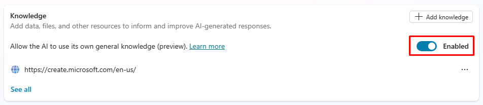

---
lab:
  title: Microsoft Copilot Studio で生成 AI を使用する
  module: Enhance Microsoft Copilot Studio copilots
---

# Microsoft Copilot Studio で生成 AI を使用する

## シナリオ

このラボでは、次のことを行います。

- エージェント アクションを作成する

## 学習する内容

- 生成回答機能を使用してエージェントの応答を改善する方法

## ラボ手順の概要

- 生成 AI を有効にする
- ナレッジの追加
  
## 前提条件

- **ラボ: エージェント アクションの作成**を完了している必要があります

## 詳細な手順

## 演習 1 - 生成 AI を構成する

### タスク 1.1 - 生成 AI を有効にする

1. まだ開いていない場合は、Microsoft Copilot Studio ポータル `https://copilotstudio.microsoft.com` に移動し、適切な環境にあることを確認します。

1. 左側のナビゲーションから **[エージェント]** を選択します。

1. 前のラボで作成した **[Real Estate Booking Service]** を選択します。

1. 画面の右上隅にある **[Settings]** ボタンを選択します。

1. **[Generative AI]** タブを選択します。

1. **[How should your agent interact with people?]** の下の **[Generative]** を選択します。

1. **"How strict should the content moderation be?"** には、**[Medium - More Balanced]** を選択します。

1. **[保存]** を選択します。

    

1. Copilot Studio の右上にある **[X]** アイコンを選択して、**[Settings]** メニューを閉じます。

### タスク 1.2 - 会話強化トピックで生成型回答を使用する

1. **[Topics]** タブを選択し、**[System]** フィルターを選択します。

1. **[Conversational boosting]** トピックを選択します。

    

1. **[Create generative answers]** ノードを確認します。

### タスク 1.3 - ナレッジを有効にする

1. **[概要]** タブを選択します。

1. 一般的な知識が **[Enabled]** であることを確認します。

    

1. 以前のラボでは、公開 Web サイトがナレッジとして追加されていることがわかります。

### タスク 1.4 - 認証の構成

1. 画面の右上にある **[Settings]** を選択します。

1. **[セキュリティ]** タブをクリックします。

1. **認証** タイルを選択します。

1. **[Authenticate with Microsoft]** を選択します。

1. **[保存]** を選択します。

1. **[保存]** を選択します。

1. Copilot Studio の右上にある **[X]** を選択して、**[Settings]** メニューを閉じます。

1. **[Publish]** を選択し、もう一度 **[Publish]** を選択します。

## 演習 2 - ナレッジを追加する

### タスク 2.1 - Dataverse からナレッジを追加する

1. **[Knowledge]** タブを選択します。

1. **[+ Add knowledge]** を選択します。

1. **Dataverse** を選択します。

1. **Real Estate Property** テーブルを選択します。

    

1. [**次へ**] を選択します。

1. [**次へ**] を選択します。

1. **[追加]** を選択します。

### タスク 2.2 - ファイルからナレッジを追加する

1. この [**Microsoft のケース スタディ**](https://download.microsoft.com/documents/customerevidence/Files/4000007499/SummitRealtyCaseStudy.docx)または [**SummitRealtyCaseStudy.docx**](../../Allfiles/SummitRealtyCaseStudy.docx) を GitHub からダウンロードします。

1. **[+ Add knowledge]** を選択します。

1. **[ファイル]** を選択します。

1. **[Upload files]** で、ダウンロードしたケース スタディを参照して選択します。

    

1. **[追加]** を選択します。

    

## 演習 3 - フォールバック トピックの構成

### タスク 3.1 - システム フォールバック トピックで生成型回答を使用する

1. **[Topics]** タブを選択し、**[System]** フィルターを選択します。

1. **フォールバック** トピックを選択します。

    

1. **Message** ノードで **3 つのドット**を選択し、**[Delete]** を選択します。

1. **Condition** ノードの **+** アイコン、**[Advanced]** の順に選択してから、**[Generative answers]** を選択します。

1. **"Input"** フィールドの **[Activity.Text]** を選択します。

1. **[Data sources]** の **[Edit]** を選択します。

    

1. **[Search only selected sources]** を選択します。

1. **Real Estate Property** Dataverse テーブルを選択します。

1. **[Allow the AI to use its own general knowledge]** を選択解除します。

1. **[How strict should content moderation be?]** の **[Customize]** チェックボックスをオンにし、**[Medium]** を選択します。

    

1. **[保存]** を選択します。

## 演習 4 - 生成 AI のテスト

### タスク 4.1 エージェントの知識をテストする

1. 開かない場合は、画面の右上にある **[Test]** ボタンを選択してテスト パネルを開きます。

1. 画面の右上のテスト パネルの上部にある **[Conversation map]** アイコンを選択します。

    

1. **[On]** を選択します。

1. テスト パネルの上部にある **[Start a new conversation]** アイコンを選択します。

1. エージェントを調べて、ナレッジ ソースの使用方法を確認します。
