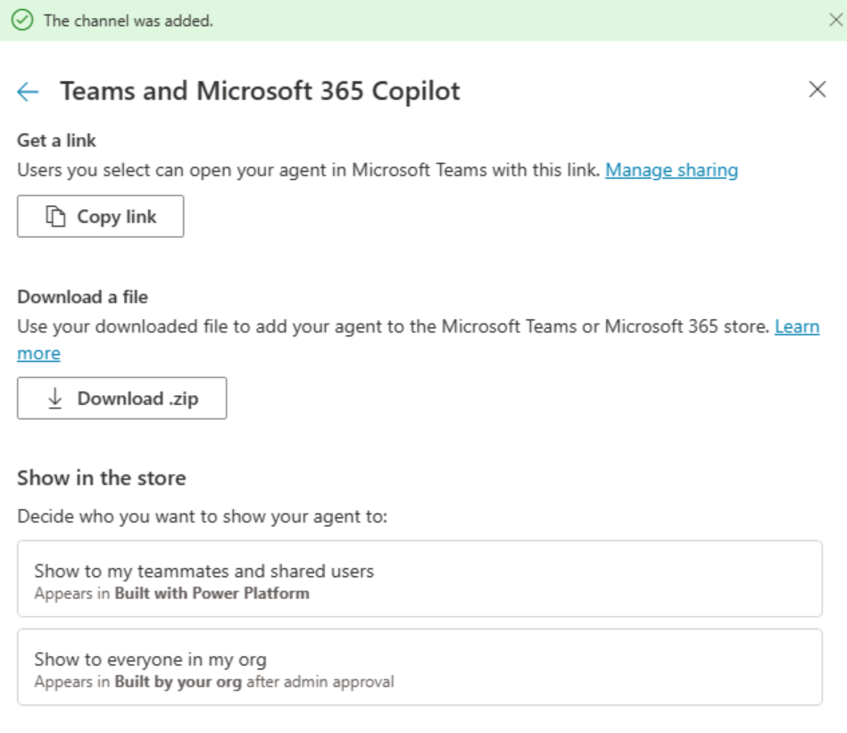

---
lab:
  title: Microsoft Teams にエージェントをデプロイする
  module: Create an agent with Microsoft Copilot Studio and Dataverse for Teams
---

# Microsoft Teams にエージェントをデプロイする

## シナリオ

この演習では、次のことを行います。

- Microsoft TeamsTeams チャネルにエージェントをデプロイする

この演習の所要時間は約 **10** 分です。

## 学習する内容

- Microsoft Teams にエージェントをデプロイする方法

## ラボ手順の概要

- 公開
- Microsoft Teams にエージェントをデプロイする
  
## 前提条件

- **ラボ: Microsoft Copilot Studio で生成 AI を使用する**を完了している必要があります

## 詳細な手順

## 演習 1 - エージェントを発行する

### タスク 1.1 - 最新のコンテンツを公開する

1. Microsoft Copilot Studio ポータル `https://copilotstudio.microsoft.com` に移動し、適切な環境にあることを確認します。

1. 左側のナビゲーション ウィンドウから **[エージェント]** を選択します。

1. 前のラボで作成したエージェントを選択します。

1. **[Publish]** を選択し、もう一度 **[Publish]** を選択します。
   > **注:** 公開には数分かかる場合があります。

## 演習 2 - チャネル

エージェントを公開すると、Teams のユーザーがそのエージェントを使用できるようになります。 こうすることで、ユーザー、ユーザーのチームメイト、より広範な組織がユーザーのコパイロットとやり取りできます。

### タスク 2.1 - Microsoft Teams チャンネル

1. エージェントを Microsoft Copilot Studio で開いた状態で、**[Channels]** タブを選択します。

1. **[Teams と Microsoft 365 Copilot]** タイルを選択します。

1. **[チャネルを追加]** を選択します。

1. **利用可能オプション**を選択します。

    

1. **[Teams でエージェントを表示する]** を選択します。

1. **"This site is trying to open Microsoft Teams"** ダイアログ ボックスで **[Cancel]** を選択します。

1. ポップアップで **[キャンセル]** を選択し、**[代わりに Web アプリを使用する]** を選択します。

1. **[追加]** を選択してエージェントを Teams に追加します。

    

1. **[Open]** を選択します。

1. エージェントをテストする。

    
